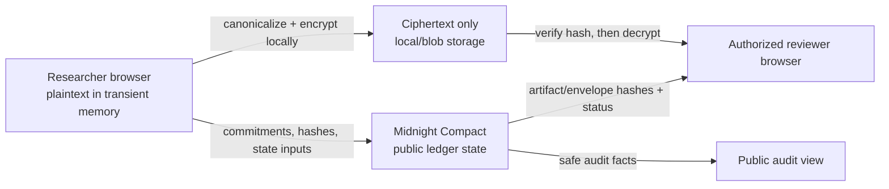

# Vulna

**Private vulnerability disclosure, with public proof of process.**

[](https://github.com/SachPlayZ/Vulna/actions/workflows/ci.yml)
[Live demo](https://vulna-midnight.vercel.app)

Vulna is a Midnight Network MVP for vulnerability disclosure and bug-bounty
workflows. Researchers encrypt reports in the browser, commit only safe
integrity references to Midnight, and give an authorized reviewer a verifiable
local decryption path.

## Live demo

Open [vulna-midnight.vercel.app](https://vulna-midnight.vercel.app) for
the hosted Acme Notes fictional-demo UI. It serves the same restrictive CSP as
local production builds; live proof-backed lifecycle verification remains on
the Midnight Preview deployment documented below.

> [!WARNING]
> Vulna's current settlement is a **transparent, non-atomic NIGHT transfer**
> followed by a researcher receipt acknowledgment. It is not escrow, shielded
> settlement, trustless settlement, or proof that a payment occurred.

## What is built

- Versioned report canonicalization, domain-separated Compact commitments, and
  replay-preventing nullifiers.
- Browser-side XChaCha20-Poly1305 encryption and Curve25519 sealed-key
  envelopes via `libsodium-wrappers-sumo`.
- Ciphertext-only storage adapters with byte-identity and hash verification.
- Encrypted, account-scoped private-state recovery; missing state fails closed.
- A Compact bounty/submission state machine with owner, reviewer, and
  researcher-proof authorization.
- Proof-backed lifecycle runner: create and open a bounty, submit, grant access, review,
  accept, patch, external NIGHT transfer, and researcher-only receipt
  acknowledgment.
- Next.js App Router UI with public bounty/audit views and a client-only report
  composer.
- CSP, security headers, Playwright browser checks, and a plaintext-sentinel
  regression suite.

## Verified Preview deployment

The harmless fictional lifecycle is deployed and indexer-confirmed on Midnight
Preview.

| Network | Contract ID | Explorer |
| --- | --- | --- |
| Preview V2 | [`02588eea120001e5589c04b8e3d60cba52330c21fb280af45f4e5c058e09b495`](https://preview.midnightexplorer.com/contracts/02588eea120001e5589c04b8e3d60cba52330c21fb280af45f4e5c058e09b495) | [Open in Midnight Explorer](https://preview.midnightexplorer.com/contracts/02588eea120001e5589c04b8e3d60cba52330c21fb280af45f4e5c058e09b495) |
| Preview V1 lifecycle fixture | [`2384e08752408e12632a56f93487ee6ff417aa0ca47ec6d6fd16b24ec6d4ae75`](https://preview.midnightexplorer.com/contracts/2384e08752408e12632a56f93487ee6ff417aa0ca47ec6d6fd16b24ec6d4ae75) | `PAID`; retained only as lifecycle evidence |

The external explorer is a public, community-built service; the app's own
verification uses the configured Midnight indexer. Preprod is not deployed yet.

## Privacy boundary



| Public | Private / encrypted |
| --- | --- |
| Bounty and submission IDs, commitments, artifact/envelope hashes, status, accepted severity, patch commitment, receipt hash | Report text, reproduction steps, attachment data, digest/openings before voluntary reveal, researcher secret, content key, reviewer private key, and reviewer notes |

Plaintext must never go on-chain or through application infrastructure before
client-side encryption. The MVP does **not** hide network metadata or timing,
determine whether a vulnerability is real, stop an authorized reviewer from
leaking a decrypted report, or detect semantic duplicates from different
researchers.

### What a public observer can and cannot learn

| An observer can learn | An observer cannot learn from Vulna's public state or ciphertext storage |
| --- | --- |
| Contract activity, transaction timing, action/status progression, and the public bounty/submission identifiers | Report plaintext, reproduction steps, attachments, reviewer notes, content keys, reviewer private keys, or researcher app secrets |
| Public commitments, artifact/envelope hashes, accepted severity, patch commitment, and receipt hash | Report digest, commitment openings, severity opening/value, or researcher ownership secret before an intentional reveal |
| The bounty's public reward amount and the existence of a `PAID` receipt acknowledgment | The payout recipient from Vulna's ledger; it is stored there only as a salted commitment |

Encrypted report envelopes use a public, immutable Vercel Blob relay. An observer may retrieve ciphertext by URL and learn its byte length, timing, and safe envelope metadata; they cannot decrypt or alter a report without the reviewer's private key and failing the browser's hash checks.

## Preview wallet flow

The hosted dApp is wired to the indexed Preview V2 contract above. It serves its proving assets directly to connected Preview wallets. The V2 deployment uses the project’s generated Preview operator wallet; its owner witness state is retained only in encrypted local private state. The frontend receives only the public address. Researchers use their own wallets to encrypt locally to an on-chain reviewer key, upload only the opaque envelope, submit the disclosure proof, wait for indexer confirmation, then grant reviewer access in a second proof transaction. The browser never fabricates a transaction ID or success state.

V2 bounty `#1` is indexer-confirmed `OPEN` on the deployed Preview contract. It binds the enrolled reviewer's public role commitment and Curve25519 encryption key. The prior V1 lifecycle fixture is `PAID` and remains lifecycle evidence only.

### Open another V2 bounty

1. On `/reviewer`, connect the intended reviewer’s Preview wallet and choose **Create or restore reviewer enrollment**.
2. Copy the displayed public JSON bundle. It contains only a reviewer role commitment, Curve25519 public key, and key version—never a private key or role secret.
3. Give that public bundle to the V2 operator. The operator runs `pnpm run create:bounty:v2:preview` with `VULNA_REVIEWER_ENROLLMENT` set to the copied JSON, plus its locally held encrypted owner state. The command creates a DRAFT then opens it only after indexer confirmation. Bounty `#1` was created this way on Preview.

The reviewer must retain the same browser’s encrypted enrollment state; deleting browser data loses its ability to decrypt future reports for that key.

The separate NIGHT transfer used for settlement is transparent. A network
observer may see and correlate that transfer outside Vulna's contract, so the
receipt hash must not be interpreted as shielded payment or payment privacy.

Read the precise [architecture](docs/ARCHITECTURE.md),
[privacy model](docs/PRIVACY_MODEL.md), [threat model](docs/THREAT_MODEL.md),
and [encrypted format](docs/CRYPTO_FORMAT.md) before changing protocol code.

## Quick start: local devnet

Requirements: Node.js 22+, pnpm, Docker Compose v2, and the Compact compiler
version documented in [docs/COMPATIBILITY.md](docs/COMPATIBILITY.md).

```bash
pnpm install --frozen-lockfile
export PRIVATE_STATE_PASSWORD='a-unique-local-secret'
pnpm run setup
pnpm run test:e2e
```

`setup` starts the local node, indexer, and proof server; compiles the Compact
contract; then runs the complete harmless lifecycle. `test:e2e` reads only
public indexed contract state and succeeds only once the receipt-linked `PAID`
state is present.

Start the product UI separately:

```bash
pnpm dev
```

Open `http://localhost:3000`. The Acme Notes pages contain fictional data only.

> [!IMPORTANT]
> The current UI encrypts and stages ciphertext in IndexedDB but deliberately
> does not claim wallet submission or Midnight confirmation. Those proof-backed
> operations are exercised by the lifecycle runner until wallet interaction is
> connected to the UI.

## Public test networks

Preview and Preprod use a user-controlled, funded **test-only** wallet. Never
paste a recovery phrase into a command, issue, or chat. Keep generated state,
wallet cache, and `PRIVATE_STATE_PASSWORD` local; they are gitignored.

```bash
# Generate/select the Preview wallet and print its public address.
pnpm run check-balance -- --network preview

# Fund that address from the Preview faucet, then run the harmless lifecycle.
export PRIVATE_STATE_PASSWORD='a-unique-local-secret'
pnpm run setup -- --network preview
pnpm run test:e2e
```

Repeat with `preprod` only after funding a Preprod wallet. The network selection
is sticky; use `pnpm run network` to inspect it or
`pnpm run network undeployed` to return to the local devnet. Network endpoints
and faucet URLs are defined in [`src/network.ts`](src/network.ts).

## Verification

```bash
pnpm test                 # 23 protocol/UI tests + 2 Compact simulator tests
pnpm run test:ci          # 21 clean-checkout protocol/privacy regression tests
pnpm run typecheck
pnpm run build
pnpm run test:web         # Chromium CSP + plaintext-sentinel checks
pnpm run test:e2e         # public indexer read-back for active network
pnpm run record:demo      # local, ignored Playwright videos
```

Browser checks fail if the sentinel appears in rendered public HTML, request
bodies, localStorage, sessionStorage, cookies, or IndexedDB. The private
report remains allowed only in the editor's transient memory and an authorized
reviewer's transient decrypted view during the test.

GitHub Actions runs `pnpm run test:ci` on every push and pull request. It
excludes the generated Compact bindings, which are intentionally created by
`pnpm run compile` rather than committed.

## Contract lifecycle

```text
Committed
  -> AccessGranted
  -> UnderReview
  -> NeedsMoreInfo -> UnderReview
  -> Accepted
  -> Patched
  -> Paid
  -> Disclosed (optional)
```

Alternative terminal paths are `UnderReview -> Rejected` and
`Committed|NeedsMoreInfo -> Withdrawn`. The contract prevents nullifier replay,
unauthorized role transitions, invalid state reversal, a second accepted
winner, and duplicate receipt acknowledgment. See
[docs/CONTRACT_STATE_MACHINE.md](docs/CONTRACT_STATE_MACHINE.md) for the exact
public ledger inventory and transition guards.

## Commands

| Command | Purpose |
| --- | --- |
| `pnpm run setup [-- --network <network>]` | Start required services, compile, and run the harmless proof-backed lifecycle. |
| `pnpm run compile` | Compile `contracts/hello-world.compact`. |
| `pnpm run deploy [-- --network <network>]` | Run the lifecycle runner after compilation/services are ready. |
| `pnpm run check-balance [-- --network <network>]` | Print the active test wallet's public address and tNIGHT/DUST balances. |
| `pnpm run network [network]` | Show or set `undeployed`, `preview`, or `preprod`. |
| `pnpm run test` | Protocol, crypto, storage, UI-preparation, and Compact simulator tests. |
| `pnpm run test:ci` | Clean-checkout protocol/privacy regression suite used by GitHub Actions. |
| `pnpm run test:web` | Build and run Chromium security/privacy checks. |
| `pnpm run record:demo` | Record ignored local browser evidence videos. |
| `pnpm run clean` | Remove generated contract and local wallet/network state. |

## Repository map

```text
app/                   Public Next.js routes
components/            Client-only composer and public UI components
contracts/             Compact bounty/submission state machine
src/crypto/            Encryption, commitments, private state, settlement
src/protocol/          Schemas, canonicalization, transition rules
src/storage/           Ciphertext-only storage adapters
src/vulna-provider.ts  Single Midnight provider factory
scripts/               Proof lifecycle, reviewer verification, E2E checks
tests/web/             Playwright privacy-boundary tests
docs/                  Architecture, crypto, privacy, threat, demo guidance
```

## Demo safety and limitations

Use the fictional Acme Notes program and harmless text only. Do not scan,
exploit, upload credentials, or test a real service.

- Attachments are disabled in the MVP UI; no active file is rendered or run.
- Settlement has no contract custody or refund path.
- The local devnet uses a well-known genesis seed. It must never be used on a
  public network or with value.
- A Preprod deployment is pending; do not describe the Preview contract as
  Preprod.

For the complete presenter flow and evidence checklist, see
[docs/DEMO.md](docs/DEMO.md).
